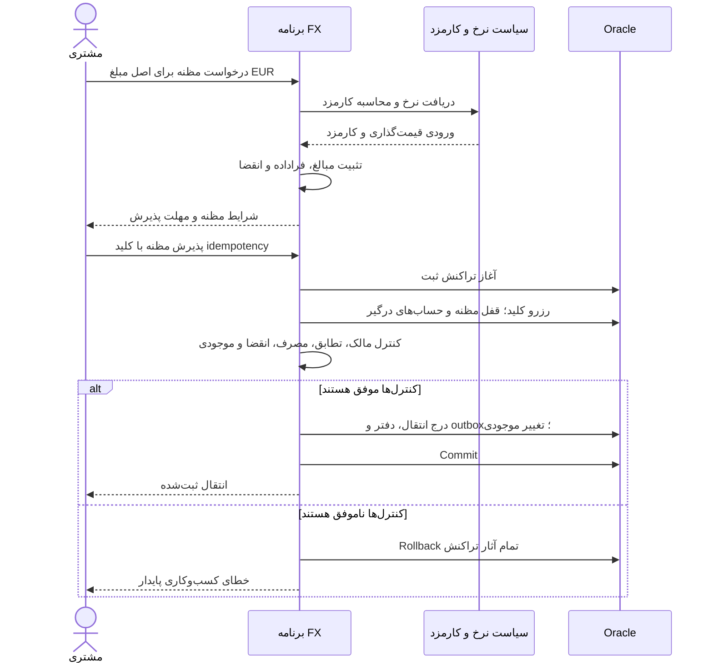
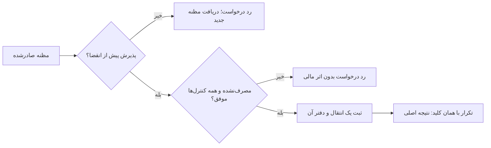
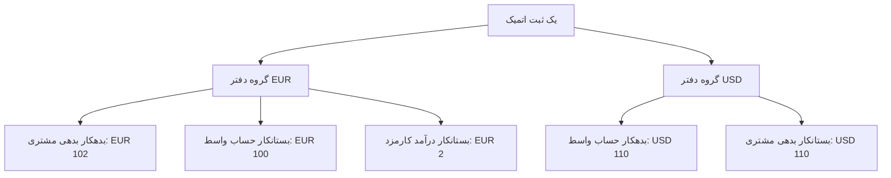
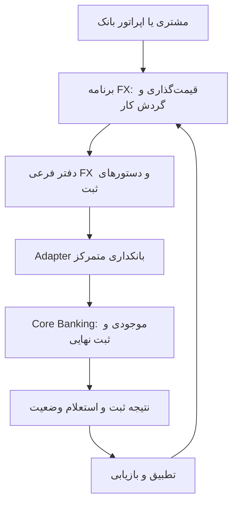

# دلیل انتخاب مظنه دارای انقضا و دفتر حسابداری مستقل برای هر ارز

[English version](QUOTE_AND_LEDGER_ARCHITECTURE.md)

وضعیت: سند توضیح معماری. تاریخ بررسی: ۲۰۲۶-۱۰-۰۹.

این سند دلیل تصمیم‌های نسخه پایه، گزینه‌های جایگزین و ارتباط آن‌ها با مستندات
عمومی شرکت‌ها را توضیح می‌دهد و قاعده کسب‌وکاری جدیدی اضافه نمی‌کند.
[تصمیم‌های طراحی](DESIGN_DECISIONS.fa.md) قرارداد اصلی پروژه،
[مدل دامنه](DOMAIN_MODEL.fa.md) مرجع قواعد تغییرناپذیر و
[نقشه راه](ROADMAP.fa.md) مرجع مراحل بعدی است. مقایسه شرکت‌ها درباره رابط عمومی
یا قابلیت محصول است؛ نه جزئیات پیاده‌سازی خصوصی آن‌ها.

[ADRهای شماره‌دار به انگلیسی](adr/README.md) این تصمیم‌ها را جداگانه ثبت
می‌کنند، از جمله [محدوده داخلی](adr/0002-internal-book-transfer-foundation.md)،
[نوع حساب‌ها](adr/0003-three-account-types.md) و
[تصویر ثابت مظنه](adr/0004-immutable-expiring-quote.md). Wise مرجع مقایسه عمومی
جریان مظنه تا انتقال و اکسیر توسن مرجع مقایسه دامنه وسیع‌تر ارز و تجارت
بین‌الملل است. نقش آن‌ها متفاوت است و هیچ‌کدام طراحی پایگاه داده یا حسابداری
این آزمایشگاه را تعیین نمی‌کنند.

## ۱. مسئله و تصمیم

یک مشتری پول را بین حساب EUR و USD متعلق به خودش تبدیل می‌کند. پیش از پذیرش،
اصل مبلغ مبدأ، مبلغ مقصد، کارمزد به ارز مبدأ، نرخ جهت‌دار و مهلت پذیرش را می‌بیند.
ثبت موفق باید همان شرایط را حفظ کند، مانع خرج بیش از موجودی و اثر مالی تکراری
شود و شواهد حسابداری قابل حسابرسی داشته باشد.

نسخه پایه این انتخاب‌ها را دارد:

- مظنه تغییرناپذیر و دارای انقضا که نتیجه محاسبات را ثابت می‌کند.
- حداکثر یک انتقال موفق برای هر مظنه، همراه با بازگرداندن امن نتیجه در تکرار درخواست.
- یک ارز برای هر حساب و توازن سطرهای دفتر درون هر ارز.
- یک تراکنش محلی Oracle برای ثبت انتقال و تمام آثار مالی آن.
- موجودی ساختگی حساب‌های واسط؛ اجرای معامله در بازار و تسویه خارجی خارج از نسخه پایه است.

این تصمیم‌ها مستقل هستند. محصول دارای قیمت تقریبی هم می‌تواند دفتر دوطرفه
داشته باشد. محصول دارای مظنه قطعی می‌تواند ثبت نهایی را به سامانه دیگری بسپارد.
انتخاب مظنه تعداد حساب‌ها را تعیین نمی‌کند و مستلزم معماری microservices نیست.

## ۲. چرا این طراحی انتخاب شد؟

دلیل از یک تعهد به مشتری شروع می‌شود: اگر شرایط نمایش‌داده‌شده در مهلت مجاز
پذیرفته شوند، ثبت انتقال از همان شرایط استفاده می‌کند. محاسبه دوباره پس از پذیرش
دستور تأییدشده مشتری را عوض می‌کند. مثلاً تبدیل نمایش‌داده‌شده ۱۰۰ یورو به
۱۱۰ دلار نباید پس از تغییر نرخ بازار، بی‌اطلاع مشتری به ۱۰۸ دلار تبدیل شود.

تغییرناپذیری، پیشنهاد پذیرفته‌شده را از تأمین‌کننده نرخ و سیاست کارمزد قابل تغییر
جدا می‌کند. مظنه نتیجه را نگه می‌دارد؛ نه ارجاعی زنده به سیاست برای محاسبه مجدد.
انقضا پنجره پذیرش را محدود می‌کند و مصرف یک‌باره تعداد اجراهای یک پیشنهاد را.

دامنه کوچک انتقال داخلی اجازه می‌دهد خطاهای مهم بدون ساخت اتصال بانکی بررسی
شوند: گرد کردن، لحظه دقیق انقضا، تکرار درخواست، قیود یکتا، برداشت‌های رقیب،
بازگشت تراکنش و تطبیق دفتر با موجودی. برنامه یکپارچه ماژولار و تراکنش محلی،
تعداد حالت‌های شکست ناقص را هنگام تثبیت این قواعد کاهش می‌دهند.

این استدلال مهندسی برای نیازمندی‌های همین پروژه است. سابقه تصمیم‌ها نشان نمی‌دهد
که طراحی اولیه از مقاله یا شرکت مشخصی گرفته شده باشد. منابع این سند برای تأیید
معقول بودن انتخاب و شناخت جایگزین‌ها بررسی شده‌اند؛ نه برای نسبت دادن منشأ
تاریخی طراحی به آن‌ها.

## ۳. مظنه فعلی چه می‌کند و چه چیزهایی هنوز برنامه هستند؟

[Quote پیاده‌سازی‌شده](../src/main/java/dev/kavrin/fxtransfer/quote/Quote.java)
مبلغ مبدأ، مبلغ مقصد، کارمزد محاسبه‌شده، `RateSnapshot`، زمان ایجاد و زمان انقضا
را نگه می‌دارد. factory مبلغ مقصد و کارمزد را فقط یک بار محاسبه می‌کند.
متد `isExpired(now)` در حالت `now >= expiresAt` مقدار true می‌دهد.

این شیء مقداری به‌تنهایی ذخیره‌سازی، مالکیت مشتری، ثبت مصرف مظنه، رزرو وجه یا
ثبت انتقال را فراهم نمی‌کند. شناسه مظنه، کنترل مالکیت، قید یکتای `quote_id` در
انتقال، idempotency، قفل ردیف‌ها و ثبت اتمیک دفتر متعلق به لایه‌های application
و persistence برنامه‌ریزی‌شده هستند. پیش از تلقی این رفتارها به‌عنوان قابلیت
پیاده‌شده، [وضعیت README](../README.md#current-status) را بررسی کنید.

نمودار زیر جریان برنامه‌ریزی‌شده ثبت را نشان می‌دهد؛ نه endpoint در حال اجرا:

نمودار تلاش اول را نشان می‌دهد. تکرار درخواست موفقِ commit‌شده، پیش از تلاش
برای ثبت جدید، همان نتیجه اصلی را برمی‌گرداند؛ حتی اگر مظنه اکنون منقضی باشد.
payload متفاوت با همان کلید تعارض است. پس از تراکنش ناموفق، تلاش مجدد همچنان
باید کنترل فعلی انقضا و موجودی را بگذراند.

## ۴. انقضا یک مرز کسب‌وکاری است

نسخه پایه فقط در حالت `now < expiresAt` پذیرش را مجاز می‌داند. زمان کنترل ثبت
یک بار و پس از گرفتن قفل‌های لازم خوانده می‌شود. درخواست رسیده پیش از انقضا
که تا پس از انقضا منتظر قفل مانده است رد می‌شود. بر اساس این قرارداد، ثبت
پذیرفته‌شده می‌تواند پس از مهلت commit شود؛ الزام انقضا در زمان commit قرارداد
متفاوتی است.

انقضا وجه مشتری یا موجودی ارز مقصد را رزرو نمی‌کند. مظنه پیشنهاد است؛ نه مدرک
امکان اجرای قطعی. تضمین واقعی نرخ نیازمند تصمیم درباره نقدینگی، سقف ریسک،
پوشش ریسک یا قفل نرخ نزد تأمین‌کننده و کنترل سوءاستفاده است. افزودن `expiresAt`
هیچ‌یک از این سازوکارها را پیاده نمی‌کند.

## ۵. جایگزین‌های قیمت‌گذاری و پذیرش

| انتخاب | قرارداد پذیرش | مزیت | هزینه یا حالت شکست |
| --- | --- | --- | --- |
| مظنه قطعی دارای انقضا، انتخاب فعلی | استفاده از شرایط ثابت در پذیرش به‌موقع و واجد شرایط | رضایت دقیق مشتری و سابقه پایدار | کنترل ریسک نرخ و پیشنهادهای مصرف‌نشده |
| مظنه تقریبی | قیمت‌گذاری مجدد هنگام اجرا | نبود تضمین مستقل در مرحله نمایش | شرایط جدید نیازمند رضایت مجدد یا حدود اجرای توافق‌شده است |
| تبدیل فوری | قیمت‌گذاری و ثبت در یک فرمان | حذف چرخه مستقل پیشنهاد ذخیره‌شده | تعیین شرایط قابل قبول اجرا و حفظ idempotency |
| نرخ‌نامه نسخه‌دار | استفاده از نسخه انتخاب‌شده نرخ منتشرشده | مناسب فرایندهای مبتنی بر تعرفه | تعیین اعتبار نسخه نمایش‌داده‌شده یا جدیدترین نسخه |
| معامله با نرخ توافقی | پذیرش شرایط معامله تأییدشده | قیمت‌گذاری خاص مبلغ یا اپراتور | چرخه تأیید، اختیار، اعتبار و اصلاحات |

دستور با مبلغ مقصد ثابت، مانند «۱۱۰ دلار دریافت کن»، تنوع دیگری در محصول است.
مقدار محاسبه‌شونده و قواعد کارمزد و گرد کردن را تغییر می‌دهد؛ ضرورت مظنه را حذف
نمی‌کند. نسخه پایه اصل مبلغ مبدأ را ثابت و کارمزد را جداگانه به آن اضافه می‌کند.

پیشنهاد منقضی باید با پیشنهاد جدید جایگزین شود. تغییر شرایط پیشنهاد قبلی، مدرک
آنچه نمایش داده شده را از بین می‌برد. اگر محصول بعدی پیش‌نویس قابل ویرایش لازم
داشت، آماده‌سازی پیش‌نویس را از snapshot تغییرناپذیر پذیرفته‌شده جدا کنید.

## ۶. پنج حساب، سه نوع حساب

مثال تبدیل ۱۰۰ یورو به ۱۱۰ دلار با کارمزد ۲ یورو پنج حساب را درگیر می‌کند.
سه نوع حساب داریم: `CUSTOMER_LIABILITY`، `FX_CLEARING_ASSET` و `FEE_REVENUE`.
نام‌ها و اثر بدهکار و بستانکار از دید حسابداری مؤسسه هستند؛ نه صرفاً موجودی
نمایش‌داده‌شده به مشتری.

| ارز | حساب | بدهکار | بستانکار | اثر موجودی |
| --- | --- | ---: | ---: | --- |
| EUR | بدهی به مشتری در مبدأ | 102.00 | | کاهش بدهی به میزان 102.00 |
| EUR | دارایی واسط ساختگی | | 100.00 | کاهش دارایی به میزان 100.00 |
| EUR | درآمد کارمزد | | 2.00 | افزایش درآمد به میزان 2.00 |
| USD | دارایی واسط ساختگی | 110.00 | | افزایش دارایی به میزان 110.00 |
| USD | بدهی به مشتری در مقصد | | 110.00 | افزایش بدهی به میزان 110.00 |

بدهکار و بستانکار EUR هر دو ۱۰۲ و بدهکار و بستانکار USD هر دو ۱۱۰ هستند.
نرخ رابطه اقتصادی این دو گروه را مشخص می‌کند؛ مبالغ آن‌ها را برای جمع حسابداری
هم‌واحد نمی‌کند.

نمودار سطرهای حسابداری را گروه‌بندی می‌کند؛ پیکان‌ها حرکت وجه خارجی نیستند.
حساب‌های واسط موجودی ساختگی این تمرین‌اند. توازن دفتر سازگاری حسابداری را نشان
می‌دهد؛ نه تسویه بانکی یا کفایت نقدینگی واقعی را.

## ۷. جایگزین‌های حساب‌ها و مالکیت ثبت

تعداد حساب‌ها تابع رخداد اقتصادی و نیاز گزارش‌گیری است. نباید «قاعده همیشگی
پنج حساب» را در برنامه ثابت کنیم.

| تنوع | اثر بر طراحی |
| --- | --- |
| نبود کارمزد جداگانه | تبدیل ساده می‌تواند چهار حساب را درگیر کند |
| وصول جداگانه کارمزد | دفتر مستقل و قواعد صریح وصول و برگشت |
| سود در فاصله نرخ خرید و فروش | تخصیص صریح سود و عملیات خزانه‌داری؛ ثبت درآمد تابع سیاست حسابداری انتخاب‌شده است |
| تسویه با بانک خارجی | حساب‌های تسویه و در صورت نیاز دریافتنی، پرداختنی یا معلق، همراه با تطبیق |
| مالکیت موجودی در Core Banking | ارسال دستور ثبت و پیگیری نتیجه؛ commit محلی موجودی دوردست ممکن نیست |

فقط تغییر دو موجودی مشتری، طرف‌های مقابل لازم در این مدل حسابداری دوطرفه را
حذف می‌کند. چیدمان دیگری معتبر است اگر رخداد را درست نمایش دهد و قواعد
حسابداری انتخاب‌شده را رعایت کند.

در نسخه پایه، سطرهای تغییرناپذیر دفتر منبع حقیقت و `booked_balance` نمای
هم‌زمان و قابل تطبیق آن است. تغییر هر دو در یک تراکنش از تغییر مستقل دو حقیقت
مالی جلوگیری می‌کند.

## ۸. چقدر به Wise نزدیک هستیم؟

در قرارداد عمومی مظنه به انتقال شباهت معناداری وجود دارد؛ مدرکی درباره یکسان
بودن پیاده‌سازی داخلی نداریم.

[مستند مظنه احراز هویت‌شده Wise](https://docs.wise.com/guides/product/send-money/quotes/authenticated-quote)
نرخ و کارمزد، شناسه مظنه برای ایجاد انتقال، `expirationTime` و
`rateExpirationTime`، گزینه‌های پرداخت و به‌روزرسانی مظنه را توضیح می‌دهد.
در Wise، `sourceAmount` شامل کارمزد است؛ اصل مبلغ مبدأ این پروژه کارمزد را شامل نمی‌شود.

نتیجه این مقایسه برای پروژه:

- نام مشابه فیلدها برای سازگاری کافی نیست. adapter باید معنای مبالغ را صریح
  تبدیل کند؛ وگرنه دستور ممکن است بیش از حد شارژ یا کمتر از نیاز تأمین شود.
- مهلت واحد برای ثبت داخلی فوری کافی است. با تأمین وجه دیرهنگام، مهلت‌های
  مستقل پذیرش و تأمین وجه مفید می‌شوند.
- حتی اگر تأمین‌کننده پیش‌نویس مظنه را قابل ویرایش بداند، شرایط پذیرفته‌شده
  محلی باید سابقه پایدار داشته باشند. تغییرپذیری منبع تأمین‌کننده و
  تغییرناپذیری سابقه پذیرش مسئولیت‌های متفاوتی هستند.
- اتصال واقعی نیازمند تعریف گیرنده، تأمین وجه، پرداخت خروجی، تغییر وضعیت و
  بازیابی است تا نسخه پایه بتواند آن مسیر را نمایش دهد.

پیاده‌سازی موجود بخشی از دامنه پولی است. تست موفق مظنه نشان‌دهنده سرویس انتقال
عملیاتی مشابه Wise نیست. مستند API عمومی نیز ساختار حساب‌ها، پایگاه داده، قفل‌ها
و مرز سرویس‌های داخلی Wise را آشکار نمی‌کند. بیان درصد شباهت معماری توجیه ندارد.

## ۹. شرکت‌های دیگر چه شواهدی ارائه می‌کنند؟

### Currencycloud

[راهنمای Held FX Rates](https://developer.currencycloud.com/guides/integration-guides/held-rates/)
پیشنهاد دارای انقضا، مخصوص مبلغ و یک‌بارمصرف را پیش از ثبت تبدیل توضیح می‌دهد.
[راهنمای افزودن فاصله نرخ](https://developer.currencycloud.com/guides/integration-guides/adding-an-fx-spread/)
قیمت تقریبی با تثبیت نرخ هنگام تبدیل را هم نشان می‌دهد. این دو، انتخاب‌های
محصولی متفاوت مظنه قطعی و تقریبی را نمایش می‌دهند.

برداشت ما این است که در پشتیبانی آینده از هر دو نوع، تفاوت باید صریح بماند.
برآورد تقریبی نباید تصادفاً به تضمین مبلغ مقصد تبدیل شود.

### Modern Treasury

[راهنمای FX Wallets](https://docs.moderntreasury.com/ledgers/docs/fx-wallets)
بدهی کیف پول و دارایی نقدی مخصوص هر ارز را با تبدیل چهارحسابی نشان می‌دهد.
[مقاله سه سؤال طراحی دفتر](https://www.moderntreasury.com/journal/three-questions-to-set-up-ledgers)
طراحی را حول دامنه دفتر، ساختار حساب‌ها و جریان تراکنش‌ها سازمان می‌دهد.

این‌ها مثال حسابداری‌اند؛ نه مدرک استفاده داخلی Modern Treasury از چرخه مظنه
یا مدل حساب واسط ساختگی این پروژه.

### TOSAN و Exir

[معرفی رسمی اکسیر توسن](https://tosan.com/products/index/67?title=%D8%B3%D8%A7%D9%85%D8%A7%D9%86%D9%87+%D8%A7%D8%B1%D8%B2%DB%8C+%D8%A7%DA%A9%D8%B3%DB%8C%D8%B1)
چندنرخی بودن، تغییر نرخ‌نامه در طول روز، کارمزد پویا، الگوی سند حسابداری
رخدادهای مالی و ماژول‌های ارزی و تجارت بین‌الملل را بیان می‌کند. ساختار مظنه،
سیاست انقضا، کنترل هم‌زمانی و مالکیت موجودی را منتشر نمی‌کند.

طراحی قابل تنظیم برای تبدیل رخداد به ثبت حسابداری، برداشت معقولی از این
قابلیت‌هاست؛ نه شرح تأییدشده کد Exir. از این منبع نمی‌توان مظنه دارای انقضا یا
دفتر ثابت پنج‌حسابی را به اکسیر نسبت داد.

## ۱۰. عبور از یک تراکنش محلی

نقشه راه، مالکیت حساب‌ها، رزرو وجه و ثبت نهایی را به Core Banking مستقل منتقل
می‌کند. سرویس FX مظنه، سابقه محصول، دفتر فرعی، دستورهای ثبت و وضعیت تطبیق را
نگه می‌دارد.

این مرز هدف پروژه است؛ نه نمودار معماری Wise یا Exir. timeout شبکه ممکن است
به معنای «نتیجه نامعلوم» باشد، حتی اگر ثبت دوردست موفق شده باشد. بازیابی
نیازمند شناسه پایدار دستور، idempotency دوردست، استعلام وضعیت و تطبیق است.
rollback محلی ثبت commit‌شده دوردست را برنمی‌گرداند. outbox تحویل دستور را
قابل تکرار می‌کند؛ دو پایگاه داده را به یک تراکنش تبدیل نمی‌کند و تحویل دقیقاً
یک‌باره را تضمین نمی‌کند.

## ۱۱. پیامدها، راستی‌آزمایی و زمان بازنگری

این طراحی رضایت پایدار مشتری، قیمت‌گذاری قابل بازسازی و مرز ثبت اتمیک مشخص
فراهم می‌کند. هزینه آن ذخیره مظنه، رسیدگی به انقضا، قیود مصرف و سیاست صریح
ریسک در مراحل بعدی است. حساب‌های واسط مشترک می‌توانند محل رقابت زیاد قفل‌ها
شوند. چیدمان را پس از اندازه‌گیری و تعریف حفظ قواعد حسابداری و موجودی تغییر دهید.

شواهد لازم نسخه پایه:

1. پایداری snapshot مظنه پس از تغییر تأمین‌کننده نرخ یا سیاست کارمزد.
2. انقضا در لحظه دقیق و اعتبار در لحظه بلافاصله پیش از آن.
3. جهت ارز، دقت و گرد کردن فقط در مرز نهایی.
4. رقابت دو فرمان متفاوت برای مصرف یک مظنه.
5. بازگشت نتیجه اصلی در تکرار با همان کلید پس از انقضا.
6. جلوگیری از خرج بیش از موجودی در انتقال‌های رقیب.
7. نبود انتقال، دفتر یا تغییر موجودی ناقص پس از شکست.
8. توازن مستقل هر ارز و تطبیق دفتر با نمای موجودی.

موارد ذخیره‌سازی و تراکنش‌های رقیب نیازمند شواهد Oracle هستند؛ تست قابل حمل
شیء مقداری آن‌ها را اثبات نمی‌کند. این سند مدرک اجرای جدیدی اضافه نمی‌کند و
پیاده‌سازی ثبتِ در انتظار را کامل اعلام نمی‌کند.

با ورود تأمین وجه دیرهنگام، گیرنده خارجی، اجرای معامله نزد تأمین‌کننده، رزرو،
پذیرش نرخ‌نامه، معامله توافقی، دقت متفاوت ارزها یا Core Banking مستقل، تصمیم
را بازنگری کنید. پیش از تغییر entity یا سرویس، تعهد جدید به مشتری و حالت‌های
شکست آن را مشخص کنید.

## ۱۲. ترتیب پیشنهادی مطالعه

1. Held Rates در Currencycloud برای قرارداد پیشنهاد قطعی.
2. FX Spread در Currencycloud برای تفاوت قیمت تقریبی و قیمت اجرا.
3. مظنه احراز هویت‌شده Wise برای پذیرش، تأمین وجه و معنای مبالغ.
4. FX Wallets در Modern Treasury برای دنبال کردن دفتر واقعی نمونه در هر ارز.
5. مقاله طراحی دفتر Modern Treasury برای انتخاب حساب از جریان اقتصادی.
6. معرفی Exir در TOSAN برای مقایسه دامنه وسیع محصول، با ناشناخته ماندن جزئیات داخلی.

تمام پیوندهای شرکت‌ها منابع دست‌اول هستند. محتوا می‌تواند تغییر کند و تاریخ
بررسی زمان آماده‌سازی مقایسه را ثبت می‌کند. این منابع پشتوانه مقایسه‌اند؛ نه
وابستگی به شرکت‌ها، گواهی یا آمادگی بهره‌برداری واقعی.
