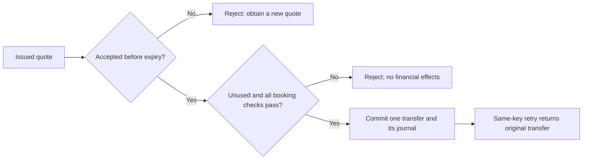
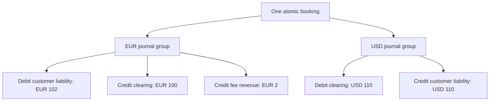
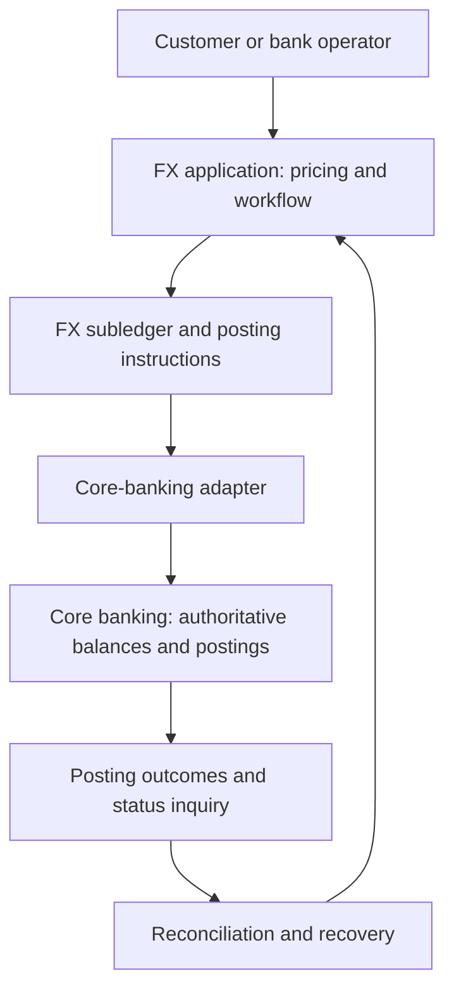

# Why the foundation uses an expiring quote and a per-currency ledger

[نسخه فارسی](QUOTE_AND_LEDGER_ARCHITECTURE.fa.md)

Status: explanatory architecture record. Reviewed on 2026-10-09.

This document explains the foundation's choices, alternatives, and relationship
to public provider documentation. It does not introduce new business rules.
[Foundation design decisions](DESIGN_DECISIONS.md) remains the normative contract;
[the domain model](DOMAIN_MODEL.md) defines invariants, and [the roadmap](ROADMAP.md)
defines later scope. Company comparisons describe public interfaces or product
capabilities, not private implementation details.

The [numbered ADRs](adr/README.md) record these choices individually, including
[internal scope](adr/0002-internal-book-transfer-foundation.md),
[account types](adr/0003-three-account-types.md), and
[quote snapshots](adr/0004-immutable-expiring-quote.md). Wise is the public
quote-to-transfer comparison; TOSAN Exir is the broader FX and trade-finance
product comparison. Their roles are different, and neither sets this lab's
database or accounting design.

## 1. The problem and the decision

One customer converts money between their own EUR and USD accounts. Before
accepting, they see a source principal, destination amount, source-currency fee,
directed rate, and acceptance deadline. Successful booking must preserve those
terms, prevent overspending and duplicate effects, and leave auditable accounting
evidence.

The foundation chooses:

- An immutable, expiring quote that fixes the calculated terms.
- At most one successful transfer per quote, with safe idempotent replay.
- One currency per account and balanced journal entries within each currency.
- One local Oracle transaction for booking and its financial effects.
- Synthetic clearing inventory; market execution and external settlement are
  outside the foundation.

These are independent decisions. An indicative-price product can still use a
double-entry ledger. A firm-quote product can delegate final posting to another
system. Choosing a quote does not determine the number of accounts or require
microservices.

## 2. Why this design was selected

The rationale begins with a customer promise: if the displayed terms are
accepted in time, booking uses those terms. Recalculating after acceptance would
change the instruction the customer approved. For example, a displayed EUR 100
to USD 110 conversion must not silently become USD 108 after the live rate moves.

Immutability separates the accepted offer from mutable rate providers and fee
policies. The quote stores their results instead of retaining a live policy for
later recalculation. Expiry bounds the acceptance window; single-use booking
bounds the number of executions against one offer.

The small internal-book scope makes important failure cases observable without
first building bank connectivity: rounding, exact expiry, retries, unique
constraints, competing debits, rollback, and reconciliation. A modular monolith
and local transaction reduce the number of partial-failure cases while those
invariants are established.

This is engineering rationale for this project's requirements. The historical
design record does not establish that a particular company or article supplied
the original design. The references below provide corroboration and alternatives
reviewed for this document, not retrospective proof of its origin.

## 3. What the current quote does, and what is still planned

The implemented [Quote](../src/main/java/dev/kavrin/fxtransfer/quote/Quote.java)
stores source amount, destination amount, calculated fee, `RateSnapshot`,
creation instant, and expiry instant. Its factory calculates the destination
amount and fee once. `isExpired(now)` is true when `now >= expiresAt`.

The value object does not itself provide persistence, customer ownership,
consumption tracking, funds reservation, or transfer booking. Quote identifiers,
ownership checks, a unique transfer `quote_id`, idempotency, row locks, and atomic
journals belong to the planned application and persistence layers. See the
[README status](../README.md#current-status) before treating planned behavior as
implemented.

The following diagram shows the planned booking flow, not a running endpoint:

```mermaid
sequenceDiagram
    actor Customer
    participant FX as FX application
    participant Pricing as Rate and fee policies
    participant DB as Oracle
    Customer->>FX: Request quote for EUR principal
    FX->>Pricing: Obtain rate and calculate fee
    Pricing-->>FX: Pricing inputs and calculated fee
    FX->>FX: Freeze amounts, metadata and expiry
    FX-->>Customer: Quote terms and acceptance deadline
    Customer->>FX: Accept quote with idempotency key
    FX->>DB: Begin booking transaction
    FX->>DB: Reserve key; lock quote and affected accounts
    FX->>FX: Check owner, match, unused state, expiry and funds
    alt Validation succeeds
        FX->>DB: Insert transfer, journal and outbox; update balances
        FX->>DB: Commit
        FX-->>Customer: Booked transfer
    else Validation fails
        FX->>DB: Roll back all transaction effects
        FX-->>Customer: Stable business error
    end
```

The diagram depicts a first attempt. A committed replay returns the original
result before attempting a fresh booking, even if the quote has since expired.
A different payload under the same idempotency key is a conflict. After a failed
transaction, a retry must still pass current quote and funds checks.

## 4. Expiry is a business boundary

The foundation accepts only while `now < expiresAt`. Capture the booking check's
instant once, after acquiring the relevant locks. A request that arrives before
expiry but waits for locks until after expiry is rejected. An already accepted
booking may commit after the deadline under this check-time rule; imposing a
commit-time deadline would be a different contract.



Expiry does not reserve customer funds or destination inventory. A quote is an
offer, not proof that execution remains feasible. A production guarantee also
needs a decision about liquidity, exposure limits, hedging or provider-backed
rate locks, and abuse controls. Merely adding `expiresAt` implements none of
those mechanisms.

## 5. Alternatives for pricing and acceptance

| Choice | Acceptance contract | Advantage | Cost or failure case |
| --- | --- | --- | --- |
| Firm expiring quote, selected | Use the frozen terms if timely and eligible | Exact customer consent; stable audit record | Rate exposure and unused offers need controls |
| Indicative quote | Price again at execution | No separate price guarantee during the preview | Changed terms need renewed consent or agreed execution limits |
| Immediate conversion | Price and book in one command | No separate persisted offer lifecycle | Request must define acceptable execution terms; retries still need idempotency |
| Versioned rate table | Use a selected published rate version | Suitable for tariff-driven workflows | Must define latest-version versus displayed-version acceptance |
| Negotiated deal | Accept explicitly approved deal terms | Supports amount-specific or operator pricing | Approval, authority, validity and amendments need their own lifecycle |

A target-fixed instruction, such as "receive USD 110", is another product
variation. It changes which amount is calculated and how fees and rounding are
handled; it does not remove the quote requirement. The foundation fixes the
source principal and charges the fee on top.

An expired offer should produce a new offer. Mutating the original terms would
destroy evidence of what was shown. If future products need editable drafts,
separate draft preparation from an accepted immutable snapshot.

## 6. Five accounts, three account types

The EUR 100 to USD 110 example with a EUR 2 fee affects five account instances.
It uses three types: `CUSTOMER_LIABILITY`, `FX_CLEARING_ASSET`, and `FEE_REVENUE`.
These names and signs express the institution's accounting perspective, not the
customer's screen balance.

| Currency | Account | Debit | Credit | Balance effect |
| --- | --- | ---: | ---: | --- |
| EUR | Customer source liability | 102.00 | | Decrease liability by 102.00 |
| EUR | Synthetic clearing asset | | 100.00 | Decrease asset by 100.00 |
| EUR | Fee revenue | | 2.00 | Increase revenue by 2.00 |
| USD | Synthetic clearing asset | 110.00 | | Increase asset by 110.00 |
| USD | Customer destination liability | | 110.00 | Increase liability by 110.00 |

EUR debits equal EUR credits at 102.00. USD debits equal USD credits at 110.00.
The rate relates these groups economically; it does not make their amounts
arithmetically interchangeable.



The diagram groups accounting entries; its arrows do not describe external cash
movement. The clearing accounts are fictional inventory for this exercise.
Balanced entries prove accounting consistency, not bank settlement or sufficient
real-world liquidity.

## 7. Alternatives for accounts and booking ownership

Account count follows the economic event and reporting needs. It should not be
hard-coded as a universal "five-account rule".

| Variation | Effect on the design |
| --- | --- |
| No separately charged fee | The simple conversion can affect four accounts |
| Fee collected separately | Another journal and explicit collection/reversal rules |
| Spread embedded in the rate | Explicit treasury and profit attribution; revenue treatment must follow the chosen accounting policy |
| External bank settlement | Settlement and possibly receivable, payable or suspense accounts, plus reconciliation |
| Core banking owns balances | FX sends posting instructions and tracks outcomes; it cannot locally commit the remote balances |

Two customer balance updates alone omit the counterparties needed for this
double-entry model. A different account layout is valid if its entries represent
the event faithfully and satisfy the chosen accounting invariants.

The foundation keeps immutable journal entries authoritative and stores
`booked_balance` as a synchronous, reconcilable projection. Updating both in the
same transaction avoids independently changing two financial truths.

## 8. How close is this to Wise?

There is a meaningful similarity in the public quote-to-transfer contract;
there is no evidence of equivalence in internal implementation.

[Wise's authenticated quote documentation](https://docs.wise.com/guides/product/send-money/quotes/authenticated-quote)
describes rate and fee information, a quote ID used to create a transfer,
`expirationTime` and `rateExpirationTime`, payment options, and quote updates.
Its `sourceAmount` includes fees; this lab's source principal excludes them.

For this project, that comparison has several consequences:

- Similar field names are insufficient for compatibility. An adapter must map
  amount semantics explicitly or it can overcharge or underfund an instruction.
- The single foundation deadline is adequate for immediate internal booking.
  Separate acceptance and funding deadlines become useful when funding is delayed.
- Immutable accepted terms remain useful even when a provider allows draft quote
  updates. Provider resource mutability and local accepted-history immutability
  are different responsibilities.
- A real provider integration needs requirements for recipients, funding, payout,
  status changes and recovery before this foundation can represent that journey.

The existing implementation is a monetary-domain slice. Successful quote tests
do not establish a working Wise-like transfer service. Public API documentation
also does not reveal Wise's chart of accounts, database, locks, or internal
service boundaries. No percentage of architectural similarity is justified.

## 9. What the other companies contribute

### Currencycloud

[Held FX rates](https://developer.currencycloud.com/guides/integration-guides/held-rates/)
documents expiring, amount-specific, single-use offers followed by conversion
booking. [Adding an FX spread](https://developer.currencycloud.com/guides/integration-guides/adding-an-fx-spread/)
also documents indicative pricing that becomes locked at conversion. Together
they demonstrate that firm and indicative offers are distinct product choices.

Our inference is that the lab should preserve that distinction if both are ever
supported. An indicative estimate must not accidentally promise a guaranteed
destination amount.

### Modern Treasury

[FX wallets](https://docs.moderntreasury.com/ledgers/docs/fx-wallets)
illustrates currency-specific wallet liabilities and cash assets with a
four-account conversion. [Three questions for setting up ledgers](https://www.moderntreasury.com/journal/three-questions-to-set-up-ledgers)
organizes design around ledger scope, the chart of accounts and transaction flows.

These are accounting examples, not evidence that Modern Treasury uses the lab's
quote lifecycle or synthetic clearing model internally.

### TOSAN and Exir

[TOSAN's Exir product description](https://tosan.com/products/index/67?title=%D8%B3%D8%A7%D9%85%D8%A7%D9%86%D9%87+%D8%A7%D8%B1%D8%B2%DB%8C+%D8%A7%DA%A9%D8%B3%DB%8C%D8%B1)
describes multiple rates, intraday rate-table updates, dynamic fees, accounting
templates for financial events, and FX/trade-finance modules. It does not disclose
the quote schema, expiry policy, concurrency controls or balance ownership.

A configurable event-to-posting design is a reasonable inference from those
capabilities. It is not a verified description of Exir's code. Neither an
expiring quote nor a fixed five-account journal can be attributed to Exir from
this source.

## 10. Moving beyond one local transaction

The roadmap moves authoritative accounts, reservations and final postings into
a separate core-banking system. The FX service retains quotes, product history,
its subledger, posting instructions and reconciliation state.



This is the project's target boundary, not a Wise or Exir architecture diagram.
A network timeout can mean "outcome unknown" even when a remote posting succeeded.
Recovery needs durable instruction IDs, remote idempotency, status inquiry and
reconciliation. A local rollback cannot undo an already committed remote posting.
An outbox makes instruction delivery retryable; it does not make both databases
one transaction or guarantee exactly-once delivery.

## 11. Consequences, verification and revisit triggers

The design buys stable consent, reproducible pricing and a clear atomic booking
boundary. It costs quote storage, expiry handling, consumption constraints and
an explicit future exposure policy. Shared clearing accounts can also become
lock hot spots; change their layout only after measuring contention and defining
how the replacement preserves accounting and funds checks.

Required foundation evidence includes:

1. Quote snapshot stability when the provider or fee policy changes.
2. Exact expiry and the instant immediately before expiry.
3. Currency direction, scale and final-boundary rounding.
4. Two different commands competing to consume one quote.
5. Same-key retry after expiry returning the committed original result.
6. Competing transfers unable to overspend one account.
7. Failure leaving no partial transfer, journal or balance effects.
8. Per-currency balance and reconciliation against booked projections.

Items involving persistence and competing transactions require Oracle evidence;
portable value-object tests cannot establish them. This document adds no runtime
verification and does not mark the pending booking implementation complete.

Revisit the decision when a requirement introduces delayed funding, external
beneficiaries, provider execution, reservations, rate-table acceptance,
negotiated deals, multiple currency precisions or separate core banking. Define
the new customer promise and failure cases before changing entities or services.

## 12. Suggested reading order

1. Currencycloud held rates: understand the firm-offer contract.
2. Currencycloud FX spread: contrast indicative and execution pricing.
3. Wise authenticated quotes: examine acceptance, funding and amount semantics.
4. Modern Treasury FX wallets: follow a concrete per-currency journal.
5. Modern Treasury ledger-design article: choose accounts from economic flows.
6. TOSAN Exir: compare the broader product scope while keeping internals unknown.

All company links are primary sources. Their contents may change; the review date
records when this comparison was prepared. These references support comparison,
not affiliation, certification or production readiness.
